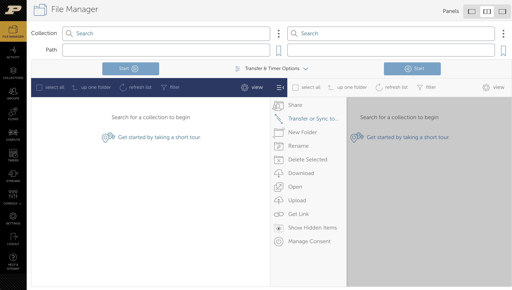
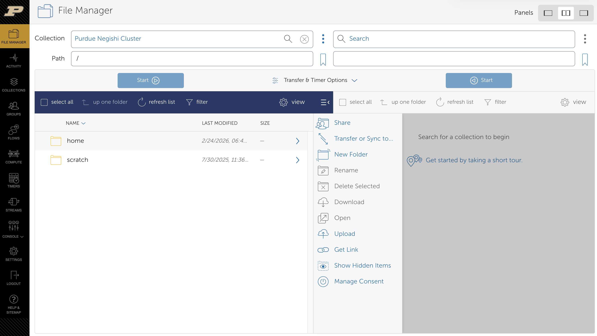
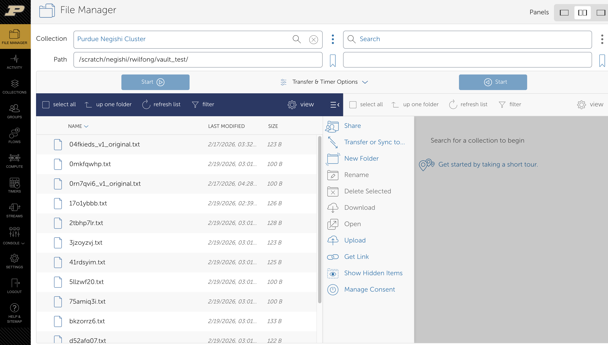
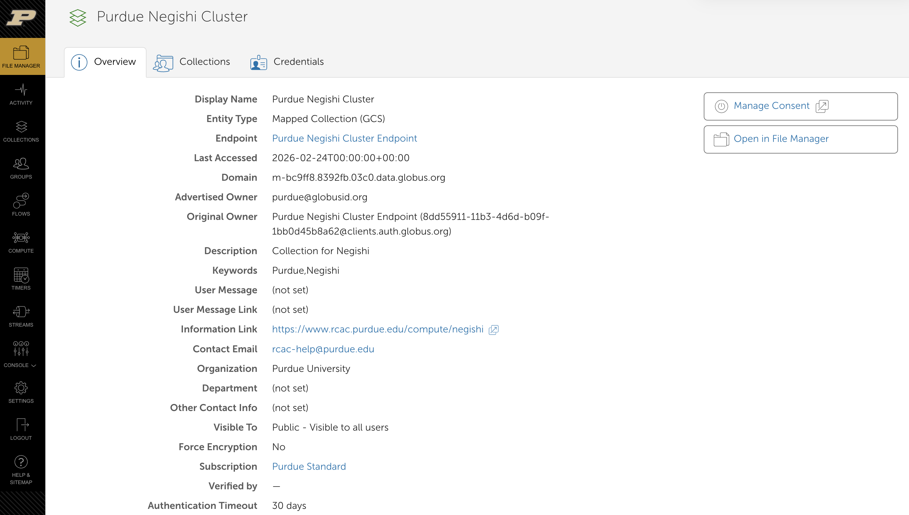
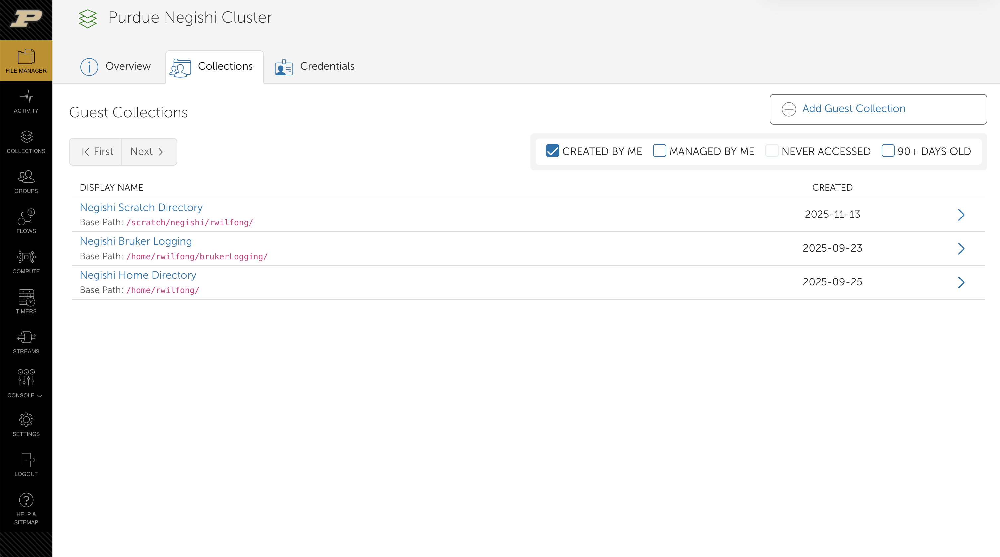
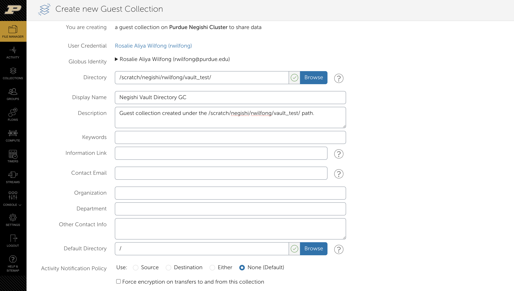
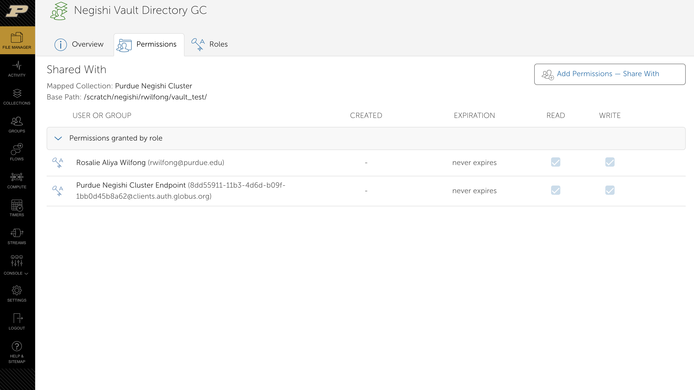
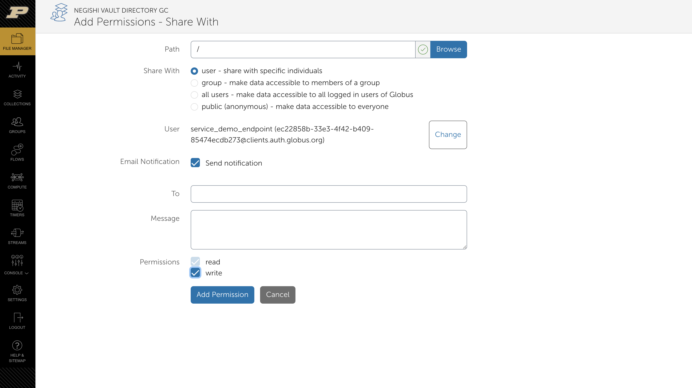
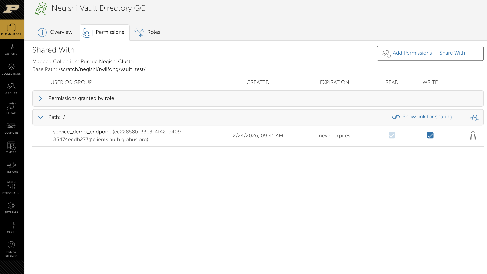

# Sharing Data with Globus: Creating a Guest Collection on a GCS Collection

Guest collections allow users to: 
- Expose *only* the specific directory you choose, and nothing above it.
- Grant read-only or read/write access.
- Tie access to a specific person's institutional identity (their university login via their institution's identity provider).
- Revoke access instantly at any time.
- Keep a full audit log of who accessed what.

The collaborator never touches the underlying system. They interact only with Globus, which acts as a secure intermediary.

### Step 1: Log In to the Globus Web App

Navigate to [transfer.rcac.purdue.edu](transfer.rcac.purdue.edu) and log in. This will use MFA to authenticate with Purdue credentials. This will activate an account associated with your @purdue.edu email.

> **Tip**: To get a two-paned view, click the double-paned option in the middle on the `panes` selection on the right side.

### Step 2: Navigate to the Mapped Collection

Using the menu search bar, type in the collection you want to create a guest collection on. Click on the collection to open it. In the image below, Negishi has been pulled up.

### Step 3: Browse to the Directory You Want to Share

Navigate to the file path you would like to share using the **path** option under the collection. 

Make note of the full path — you'll need it in the next step. In this example, I'm using `/scratch/negishi/rwilfong/vault_test`.

### Step 4: Create the Guest Collection

From the File Manager, click on the three horizontal dots next to the collection name. This will redirect the page to a collection overview. Click on the **Collections** tab.

This tab shows all of the guest collections currently created on this GCS collection.

To create a new guest collection, click the **+ Add Guest Collection** button. In this example, I have three guest collections already created.

### Step 5: Fill in the Guest Collection Details

You'll be presented with a form:

**Display Name** *(required)*: Give your guest collection a descriptive name. Something like `Smith Lab — 2024 RNA-seq Results` is better than `my_share`. This name is what your collaborators will search for.

**Base Directory** *(required)*: This should already be pre-filled with the path you navigated to. Verify it is correct. The guest collection will expose this directory and everything within it — collaborators cannot navigate above this path.

**Description** *(optional but recommended)*: Add a brief description of what data this collection contains and who it's intended for. Useful for your own reference later.

**Keywords** *(optional)*: Tags to help with searchability within your organization.

Once filled in, click **"Create Collection"**.

### Step 6: Set Permissions on the Guest Collection

After creation, you'll be taken to the guest collection's detail page. Click the **"Permissions"** tab. The default permissions are for your account.

Click **"Add Permissions"**. You'll configure:

**Path**: The subdirectory within the guest collection to grant access to. Use `/` to grant access to the entire guest collection (the full base directory you set), or specify a subdirectory for finer-grained control.

**Identity or Group**: Enter the Globus identity of your collaborator. This is typically their email address associated with their Globus account, or you can search by name. You can also grant access to a **Globus Group** (useful for sharing with a whole team at once).

**Email Notification**: When checked, the user you're sharing the data with will be sent an email.

**Permissions**:
- `read` — The collaborator can browse and download files. They cannot make changes.
- `read, write` — The collaborator can also upload, rename, and delete files within the shared path. Use with caution.

Click **"Add Permission"** to confirm. The collaborator will receive an email notification from Globus with a link to access the collection. In this case, I have added a confidential client (not a human account).

> **Tip**: For most data-sharing scenarios, grant `read` only. If collaborators need to upload data back to you, `read, write` is appropriate, but consider creating a dedicated write-only upload folder for that purpose.

### Step 7: Verify Access

Once adding the permissions, you will be redirected back to the permissions overview. You can veriy that it has been shared under the specific path.

It's good practice to verify the setup. You can do this by:

- Asking your collaborator to confirm they can see and access the collection.
- Temporarily logging in with a secondary Globus account (e.g., using your Google identity instead of your institutional one) to simulate the collaborator's experience.

In the **Permissions** tab of your guest collection, you can see all current permissions at a glance.

---

## Managing Your Guest Collection

### Revoking Access

To remove a collaborator's access, go to the guest collection's **Permissions** tab, find their entry, and click the trash/delete icon. Access is revoked immediately.

### Modifying Permissions

You can change a user's permission level (e.g., from `read, write` to `read` only) by deleting their existing permission entry and adding a new one with the updated settings.

### Deleting the Guest Collection

If the sharing period is over, navigate to the guest collection in **Collections**, click the **Settings** or **Actions** menu, and select **Delete Collection**. This removes the Globus share but does **not** delete the underlying data on your storage system.

### Monitoring Activity

Globus keeps logs of transfer activity. You and your collection administrator can view transfer history under the **Activity** tab in the web app. This provides an audit trail of who transferred what and when.

---

## Tips and Best Practices

**Create a dedicated sharing directory.** Rather than sharing your entire project directory, create a subfolder (e.g., `/project/mylab/shared/`) and symlink or copy only the data you intend to share into it. This gives you clean separation between internal working files and shared outputs.

**Use Globus Groups for team sharing.** If you're sharing with multiple people at an institution or on a project, create a Globus Group, add members to the group, and grant permissions to the group. When collaborators join or leave, just update the group membership — no need to update every collection's permissions individually.

**Prefer read-only when in doubt.** Read-only access ensures collaborators can't accidentally modify or delete your data.

**Set an expiration on permissions.** When adding a permission, some GCS configurations allow you to set an expiration date. Use this when sharing for a defined project period so you don't have to remember to clean up later.

**Communicate the collection name clearly.** Tell your collaborators the exact name of the guest collection so they can find it easily via search at app.globus.org.

---

## Guide for Data Recipients: What You Can Do with a Shared Collection

*If someone has shared a Globus Guest Collection with you, this section is for you. You don't need to understand how the collection was set up — you just need a Globus account and one of the methods below to access and use the data.*

### Step 0: Create a Globus Account (if you don't have one)

Go to [transfer.rcac.purdue.edu](transfer.rcac.purdue.edu) and sign in. This will utilize their Purdue account and email address. They will use MFA to sign in. In the case this is an external user, they can either create a Globus account or use their institutional login at [globus.org](globus.org).

### Finding the Shared Collection

You'll receive an email from Globus with a direct link to the collection. If you've lost it, log in to [transfer.rcac.purdue.edu](transfer.rcac.purdue.edu), go to **Collections**, and click the **"Shared with You"** tab. The collection should appear there by name.

---

### Option 1: Browse and Download Files via the Web App

This is the simplest option and requires no software installation beyond a browser.

1. Open the collection link in your browser and log in to Globus if prompted.
2. You'll land in the **File Manager**, which shows the folder structure the data owner has shared with you. You can navigate into subfolders just like a file explorer.
3. To download individual files or small folders, check the box next to the file(s) you want, then click the **"Download"** button in the toolbar. Globus will package them and trigger a browser download.

**When to use this**: Small files, spot-checking data, or when you just need one or two things quickly. For large datasets (gigabytes to terabytes), use the transfer method below — browser downloads are not reliable at scale.

---

### Option 2: Transfer Data to Another Globus Collection (Recommended for Large Data)

This is the most powerful option and what Globus is purpose-built for. Instead of downloading to your local machine and re-uploading elsewhere, you transfer directly from the shared collection to wherever you need the data — your institution's HPC cluster, your own Globus-connected storage, or a cloud bucket. Globus manages the transfer entirely in the background.

**What you need**: A destination collection. This could be:
- Your institution's HPC or research storage. These collections can be searched for by name, e.g., "Negishi", "Gautschi", "Data Depot".
- A personal endpoint on your own machine using **Globus Connect Personal** (see Option 3 below).

**Steps**:

1. Open the shared collection in the **File Manager**. This becomes your **source** (left panel).
2. In the right panel, click **"Search"** and find your destination collection.
3. Navigate to the destination folder where you want the data to land.
4. Back in the left panel, select the files or folders you want to transfer (check their boxes, or select the top-level folder to get everything).
5. Click the **"Start"** button (the arrow pointing toward the destination panel) to begin the transfer.
6. Globus will show a confirmation. You can close your browser — the transfer continues on Globus' infrastructure. You'll receive an email when it completes.

**Why this is better than downloading**: Globus performs checksumming (verifies every file's integrity after transfer), handles automatic retries on network interruptions, and can sustain transfers of terabytes over many hours or days without you watching it. Browser downloads offer none of these guarantees.

---

### Option 3: Transfer Data to Your Local Computer

If you need the data on your laptop or desktop machine rather than a remote server, you can use **Globus Connect Personal** to turn your computer into a Globus endpoint and then use the transfer method above.

**Setup (one-time)**:

1. Download and install Globus Connect Personal from [globus.org/globus-connect-personal](https://www.globus.org/globus-connect-personal). It's available for macOS, Windows, and Linux.
2. Open the app and log in with your Globus account.
3. Give your personal endpoint a name (e.g., "Rose's Work Computer") and complete setup.
4. By default, Globus Connect Personal exposes your home directory as a collection. You can configure which folders are accessible in the app's preferences.

**Transferring**:

Once Globus Connect Personal is running, your local machine appears as a collection in the File Manager. Use the two-panel transfer workflow from Option 2, shared collection on the left, your personal endpoint on the right, and click **Start**. Your machine must be on and Globus Connect Personal must be running for the duration of the transfer (though you can lock your screen or close other apps; just don't put the computer to sleep).

---

### What You Cannot Do (by Design)

Unless the data owner has explicitly granted write access, as a recipient of a read-only guest collection you cannot:

- Upload, modify, rename, or delete files in the shared collection.
- Navigate to directories above the base path the owner configured - the guest collection is a walled garden by design.
- Share the collection with others or change its permissions.
- See who else has access to the same collection.

These restrictions are intentional and protect the data owner's broader filesystem. If you need write access or need to reshare data with a colleague, contact the collection owner directly.

---

## Troubleshooting

**"You do not have permission to create a guest collection."**
The mapped collection administrator has not granted you the necessary role. Contact your HPC or research computing support team and ask them to grant you the `Access Manager` or `Administrator` role on the mapped collection, or ask if guest collection creation is enabled.

**Collaborator can't find the collection.**
Guest collections may be set to private (not publicly searchable). Share the direct link from your collection's detail page rather than relying on search. The URL will look like `https://transfer.rcac.purdue.edu/file-manager?origin_id=<UUID>`.

**Collaborator gets a "permission denied" error when accessing.**
Double-check the permission entry under the **Permissions** tab. Ensure their Globus identity (the email they use to log in to Globus) matches what you entered. They may use a different email for Globus than their work email.

**Transfer fails or is very slow.**
This is usually a network or endpoint configuration issue, not a permissions issue. Direct the collaborator to Globus' transfer troubleshooting documentation, or contact your institution's research computing support.

---

## Further Resources

- [Globus Documentation](https://docs.globus.org) — Official, comprehensive documentation
- [How to Share Data with Globus](https://docs.globus.org/how-to/share-files/) — Globus's own guide
- [Globus Groups](https://docs.globus.org/how-to/manage-groups/) — Managing team access