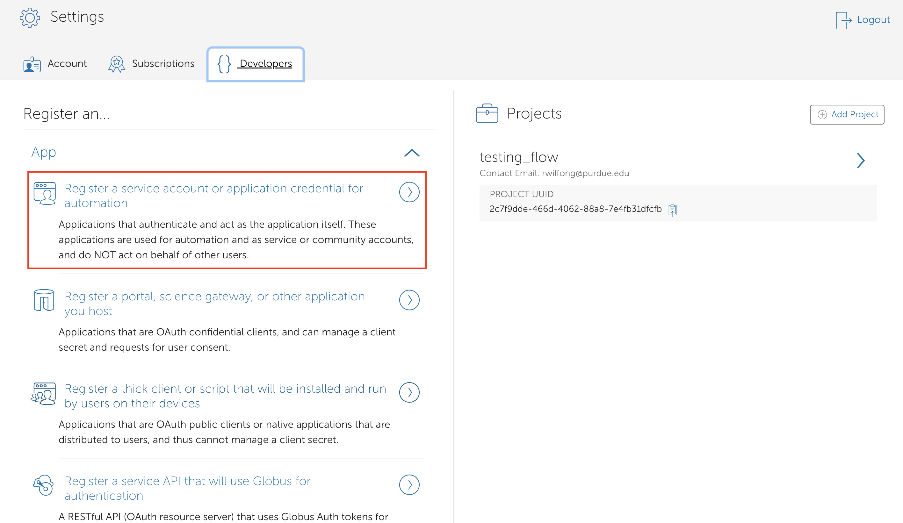
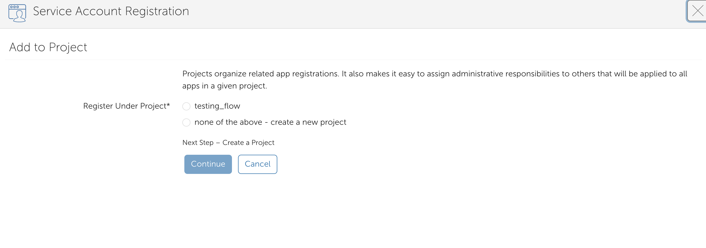
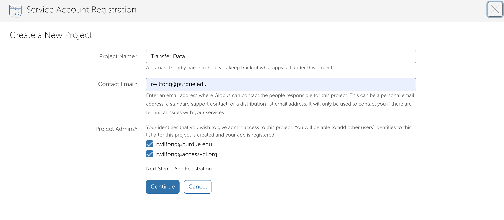
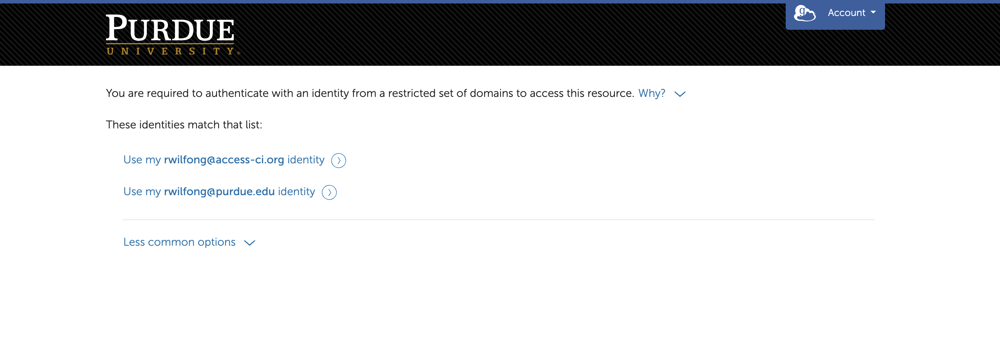
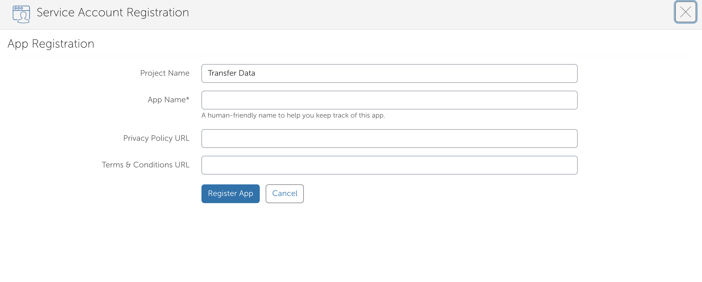
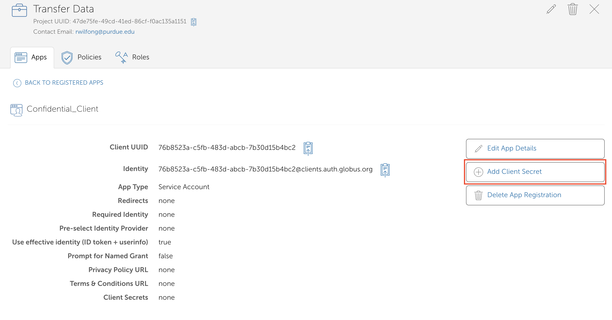
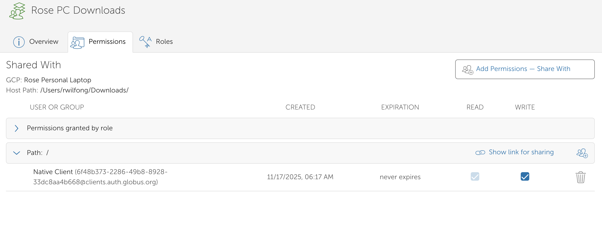
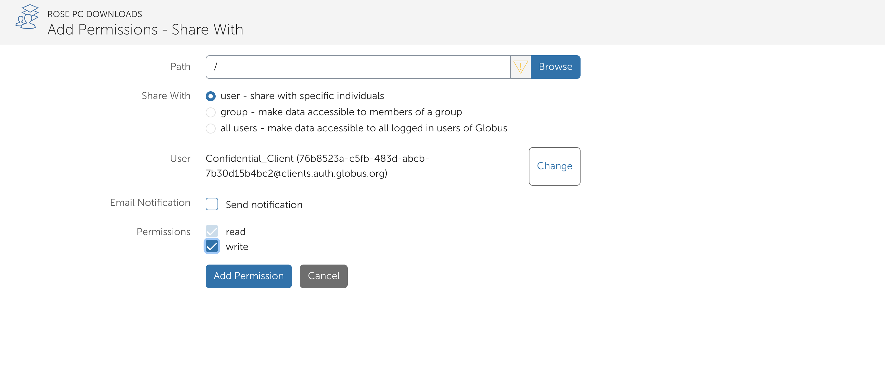

## Creating a Confidential Client for Automation

This guide walks HPC users through creating a **guest collection** and a **confidential client** in Globus to enable **automated, non-interactive data transfers** (for example, service-driven workflows, scheduled jobs, or CI-style pipelines).

The goal is to:
- Grant a confidential client permission to access that collection
- Enable automation without requiring user login at runtime

---
## Create a Confidential Client (Service Account)

To enable automation, you’ll register a **confidential client**. This client can authenticate using a client secret and perform transfers without interactive login.

---
## Step 1: Navigate to Globus

Purdue maintains its own webpage to Globus: [transfer.rcac.purdue.edu](transfer.rcac.purdue.edu). Please log in with your career account and authorize. 
 
---


## Step 2: Register a Service Account / Application

1. Click on the **Settings** option in the menu on the left side.  
2. Click the **Developers** tab.
2. Select **Register a service account or application credential for automation**.

You may be prompted to authorize with your Globus account.



---

## Step 3: Create or Select a Project

1. When prompted to associate the service account with a project, select **None of the above** to create a new project.



2. Provide:
   - **Project name** (e.g., `Transfer Data`)
   - **Contact email**
   - **Admin accounts** responsible for this project
3. Click **Continue**.



---

## Step 4: Authorize the Project

Authorize the project using one of the listed admin identities.



---

## Step 5: Register the Application

Create the confidential client:

1. Enter an **application name** (e.g., `Remote Transfer Service`).
2. Review the configuration.
3. Click **Register App**.



---

## Step 6: Create a Client Secret

On the application details page, generate a client secret.

1. Click **Add Client Secret**.



2. Provide a descriptive name for the secret.
3. Click **Generate Secret**.


> **Important:** The client secret is displayed **only once**. Store it securely (for example, in a password manager or secrets vault). Do not commit it to source control.

---

## Step 7: Record the Client UUID

Copy the **Client UUID** for the application. Example:

```
76b8523a-c5fb-483d-abcb-7b30d15b4bc2
```

This UUID represents the identity you will grant access to the guest collection.

---

## Apply Permissions to the Guest Collection

Grant the confidential client read/write access to the guest collection.

---

## Step 8: Add Permissions

1. Open the guest collection via **File Manager** or **Collections**.
2. Navigate to the **Permissions** tab.
3. Click **Add Permissions**.



4. Paste the **Client UUID** into the identity field.
5. Disable email notifications (not required for service accounts).
6. Assign **Read** and **Write** permissions.
7. Click **Add Permission**.



This grants the confidential client access to the guest collection and all subdirectories.

---

## Destination Collection

For the destination system (for example, Fortress):

1. Create a guest collection on the destination mapped collection.
2. Grant the **same confidential client** read/write permissions.

Once complete, the service can perform automated transfers between source and destination collections.

---

## Summary

You have now:

- Registered a confidential client for automation
- Generated and securely stored a client secret
- Granted the client appropriate permissions

Your Globus setup is now ready for **HPC-scale, automated data movement** 


## Tips
**How do I check transfer statuses on transfers initiated by a confidential client?**

It can be hard to tell when a transfer has completed with a confidential client becasue it does not show up in the "Transfers" page on Globus. To check the statuses, you'll need the client ID and client secret for your confidential client and you'll need to install the Globus command line interface (CLI). 

`pip install globus-cli`

Then, in a terminal:

`export GLOBUS_CLI_CLIENT_ID="<uuid>"`

`export GLOBUS_CLI_CLIENT_SECRET="<secret>"`

To see the list of transfers associated with your confidential client:

`globus task list`

To see a specific task: 

`globus task show <task ID>`

To cancel a task:

`globus task cancel <task ID>`