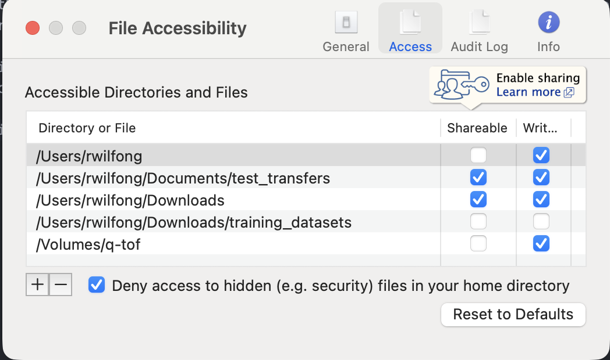
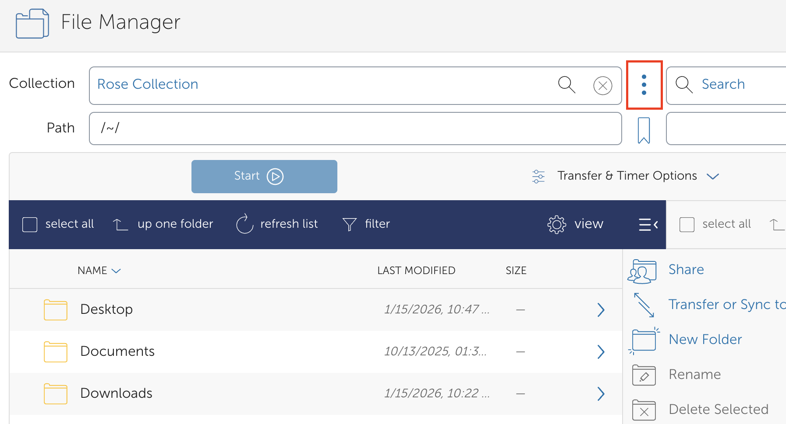
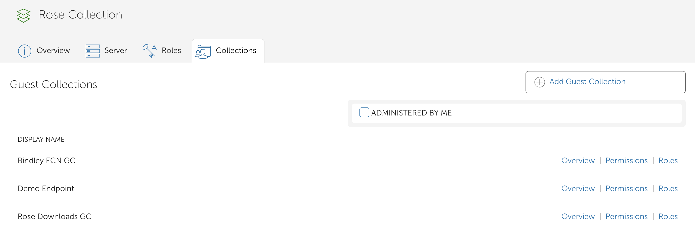

## Creating a Guest Collection

Guest collections allow you to create a *user-owned* collection on top of an existing mapped collection (for example, a cluster scratch directory or project space). This provides fine-grained control over sharing and automation, without granting direct access to the underlying storage or endpoint credentials.

---

## Prerequisites

- A Globus account
- Access to the mapped collection you want to build on
- Permission to enable sharing on the target directory

> **Note:** If this is a local GCP endpoint, ensure that **sharing and writing permissions are enabled** on the directory before proceeding.

---

## Step 1: Locate and Prepare the Mapped Collection

Identify the mapped collection that will serve as the base for your guest collection.

1. Click the **Globus widget**.
2. Navigate to **Preferences → Access**.
3. Enable the **Sharable** checkbox.

This setting allows directories under this path to be shared as guest collections.

---

## Step 2: Start Guest Collection Creation

1. Open the mapped collection in the Globus web interface.
2. Click the **three vertical dots** to the right of the collection name.

3. Select the **Collections** tab.
4. Review any existing guest collections.
5. Click **Add Guest Collection** to create a new one.

---

## Step 3: Configure the Guest Collection

You’ll be taken to a configuration page where you define:

- **Path**: The directory within the mapped collection to expose
- **Display Name**: A user-friendly name for the collection
- **Description** (optional)
- **Keywords** (optional)

Click **Create Guest Collection** when finished.

After creation, you’ll land on the guest collection details page. Leave permissions unchanged for now and click **Settings** in the left sidebar.

---
